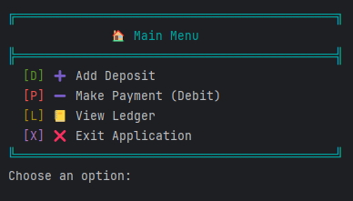

# LedgerOne - Financial Transaction Tracker CLI Application

LedgerOne is a Java-based Command-Line Interface (CLI) application for tracking financial transactions. It can be used for personal or business purposes to log deposits and payments, view a complete ledger, and generate reports. All financial data is stored in a persistent file (`transactions.csv`) ensuring data retention between sessions.

---

## 🌟 Project Overview

This CLI application allows users to:
- Record income and expenses.
- View transactions in various ways.
- Generate pre-defined and custom reports.
- Maintain all data in a standardized format: 
**date|time|description|vendor|amount**

---


## ✨ Key Features & Screens

### 🏠 Home Screen Options

- `[D]` **Add Deposit**: Log a positive (income) transaction.
- `[P]` **Make Payment (Debit)**: Log a negative (expense) transaction.
- `[L]` **Ledger**: Navigate to transaction listings and reports.
- `[X]` **Exit**: Exit the application.

---



### 📒 Ledger Screen Options

The Ledger view is the hub for analyzing transactions (newest first):

- `[A]` **All**: Show all transactions.
- `[D]` **Deposits**: Show only deposits.
- `[P]` **Payments**: Show only payments.
- `[R]` **Reports**: Access the Reports Screen.
- `[H]` **Home**: Return to the Home Screen.

---


### 📊 Reports Screen Options

Perform in-depth analysis with several filters:

- **Month To Date**: Transactions from the start of the current month.
- **Previous Month**: Transactions from the previous full month.
- **Year To Date**: From January 1st to today.
- **Previous Year**: Entire previous year.
- **Search by Vendor**: Filter by vendor name.
- **Custom Search (Challenge)**: Search in range of:
    - Start Date
    - End Date
    - Description Keyword
    - Vendor Name
    - Amount

- `Back`: Return to the Ledger Screen.

---


## 💻 Interesting Code Segment: Animated, Rainbow Console Logo

Implemented an animated, colored startup logo. This code snippet handles iterating through the characters of the logo string, applying a cyclical rainbow color, and adding a slight delay to create a retro typing animation effect.

### 🔍 Code Snippet

```java
        final String RESET = "\u001B[0m";
        int colorIndex = 0;
        try {
            for (char ch : logo.toCharArray()) {
                System.out.print(COLORS[colorIndex % COLORS.length] + ch);
                Thread.sleep(1);
                colorIndex++;
            }
            System.out.println(RESET);
        } catch (InterruptedException e) {
            System.out.println(e);
        }
```

---

**Attribution**: *Portions of this README were generated with the assistance of *ChatGPT (GPT-4)*, developed by [OpenAI](https://openai.com/), in **October 2025**. For more information, visit [https://openai.com/chatgpt](https://openai.com/chatgpt).*
